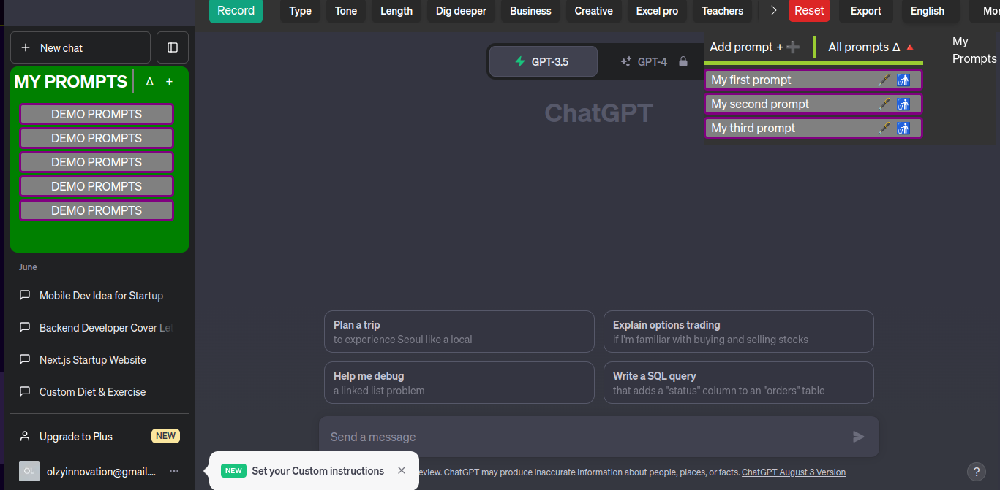
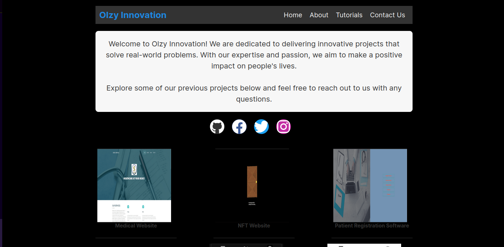
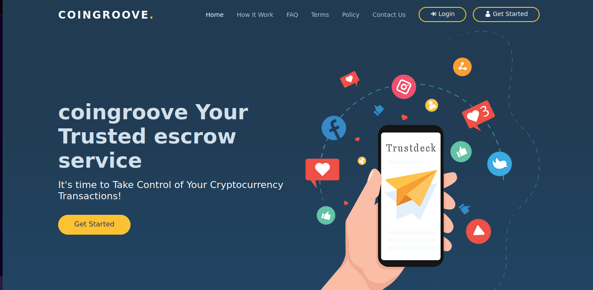

# Preliminary Online Interview Test for  Senior / Experienced Tech Talents

## Section 1: Previous experience

Q: **Please state field/area of expertise applied for**

A: *I have applied for the Senior / Experienced Software Engineer role*

Q: **How many years of relevant experience do you have in the field?**

A: *7+*

### Project 1

Q: **Name of project / product**

A: *Davebot_Forex*

Q: **Short Description of project  / product**

A: *Forex analyser and trading software*

Q: **Strategy used in implementing the project  / product**

A: *Davebot_Forex spanned over a year in development time and therefore I utilised a number of strategies.*

*I initially used started with a roadmap, highlighted the project scope and possible pitfalls before proceeding with bootstrapping boiler plate and programming*

*With consequent updates, these were updated, changed, adapted and more*

Q: **Tools used for project**

A:

    * Python
    * Virtualenv
    * Pymongo
    * Websocket
    * Openpyxl
    * flask
    * React
    * yarn
    * github
    * ...and more

Q: **Link to the screenshot of the project**

A: *[Davebot Forex on Github](https://github.com/OlzyInnovation/DaveBot_Forex)*

Q: **What was your role in the project**

A: *I was the lead developer on this project, a total of 4 developers*

Q: **Please describe some of the key activities of the project to enable us understand its complexities and your tasks in the project**

A: *[**Davebot_Forex**] is a subsidiary of the BotFather trading application (a project I also led). BotFather allows copy trading without the hassles of big corporation copytrading requirements and whitepaper loops.*

*Davebot_Forex is for intermediate scalper traders to trade using pre-programmed strategies, hold and monitor changes on the market*

*Traders can watch markets changes, scalp and have an option to have their data on a webpage or written to a spreadsheet*

### Project 2

Q: **Name of project / product**

A: *Ultimate GPT*

Q: **Short Description of project  / product**

A: *ChatGPT extension for additional functionalities*

Q: **Strategy used in implementing the project  / product**

A: **

Q: **Tools used for project**

A:

    * Javascript
    * Node.js
    * Bash
    * Express
    * OpenSSL
    * MongoDB
    * Webpack
    * NPM
    * github
    * ...and more

Q: **Link to the screenshot of the project**

A: *[Ultimate GPT](https://github.com/OlzyInnovation/Ultimate-GPT)*

Q: **What was your role in the project**

A: *I was the lead developer on this project and led a team of 5 developers*

Q: **Please describe some of the key activities of the project to enable us understand its complexities and your tasks in the project**

A: *[**Ultimate GPT**] is an extension for ChatGPT, it allows for added functionalities such as:*
    
    * User created prompts
    * User saved prompts
    * Sharing and Recording ChatGPT sessions
    * ...and more

*Ultimate GPT bridges the divide between users who cannot afford a paid subscription plan and beyond...*

## Section 2: Role Fit

|Job Requirements | Briefly describe how your ptofile and experience matches this requirement|
|-----------|----------------|
Proven experience in relevant field| I have over 6 years of professional development experience and over 4 as a lead software engineer.
HND/BSC in any related field or commensurate experience| I have over 6 years of professional development experience and over 4 as a lead software engineer.
What software tools/technology tools have you used to fulfil your role? |Primarily, I use Node.js and Python along with their libraries.   For mobile engineering, I use Flutter for cross platform and Java for native android development
Have you led a tech team before? How do you keep track of everyone’s work? | Yes, I have a led tech teams.   I set a minimum of 3 dev meetings weekly alongside a visionboard of tasks and Agile/Scrum to keep track of development
Have you ever dealt with conflicts on a project? If so, how did you handle them? | I most recently had to quell a dispute between devs on my team.   In my experience, I have found that just like programming, an understanding of the conflict root and some down time between the conflicting parties help
How often do you meet with your team during a project? Do you prefer to meet with the entire team or just team leaders? Why? | I prefer to meet with the entire team.   On my recent team, a branch lead engineer stated a particular developer as unproductive and in my meeting with the developer, I discovered his PC needed an update and was the stem of the issues he had.   I listen and follow the team leads in decision making but I much prefer meeting the entire team before any crucial decision or change is made
Describe one of your most challenging projects so far. Why was it challenging and what did you do to overcome the difficulties? | I have always developed mobile applications natively and my switch to cross platform for an industry standard mobile application was quite difficult.   I paced myself and found common grounds between native and cross platform development and widgets. Found a balance between learning, unlearning,adapting and developing the project
How do you approach task assignment within your team? | After splitting tasks based on roles, team dynamics, time and more. I assign tasks on every meeting and check-in regularly to ensure they are progressing accordingly before the next meeting.
Describe a time when you realised your current approach wasn’t working and how did you resolve it ? | I was brought on as a team lead halfway into a project and I sparringly assigned tasks based on job titles and roles. I soon realised the team members were not as productive as had been mentioned.   Not to upset team dynamics and to get the project out in time, I re-distributed tasks based on the team members tech stack
Describe your experience in working with Agile Methodology? | I much enjoy applying Agile methodology in my development both personally and professionally. I believe it to be very productive when used effectively but can also be a drag if not implemented well

## Section 3: Skills

Q: **Please share with us links to some of your work that is in public domain.  Github, Stackoverflow, Hackerrank and similar are acceptable.**

A: 

*[Ultimate GPT](https://github.com/OlzyInnovation/Ultimate-GPT)*

*[Olzy Innovation](https://olzyinnovation.com)*

*[Medical website demo](https://statuesque-faloodeh-c7828a.netlify.app)*

*[Escrow exhange website demo](https://rainbow-bienenstitch-f85634.netlify.app/)*

